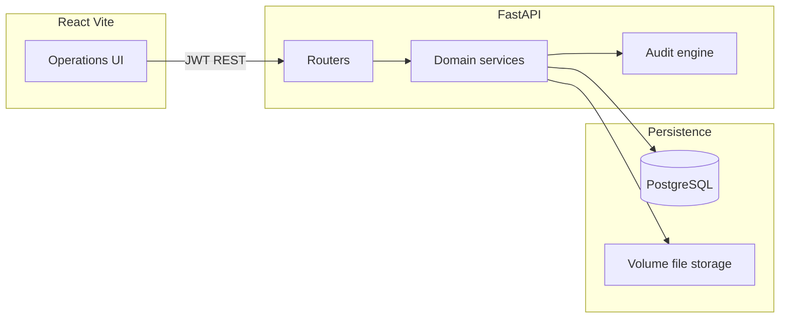
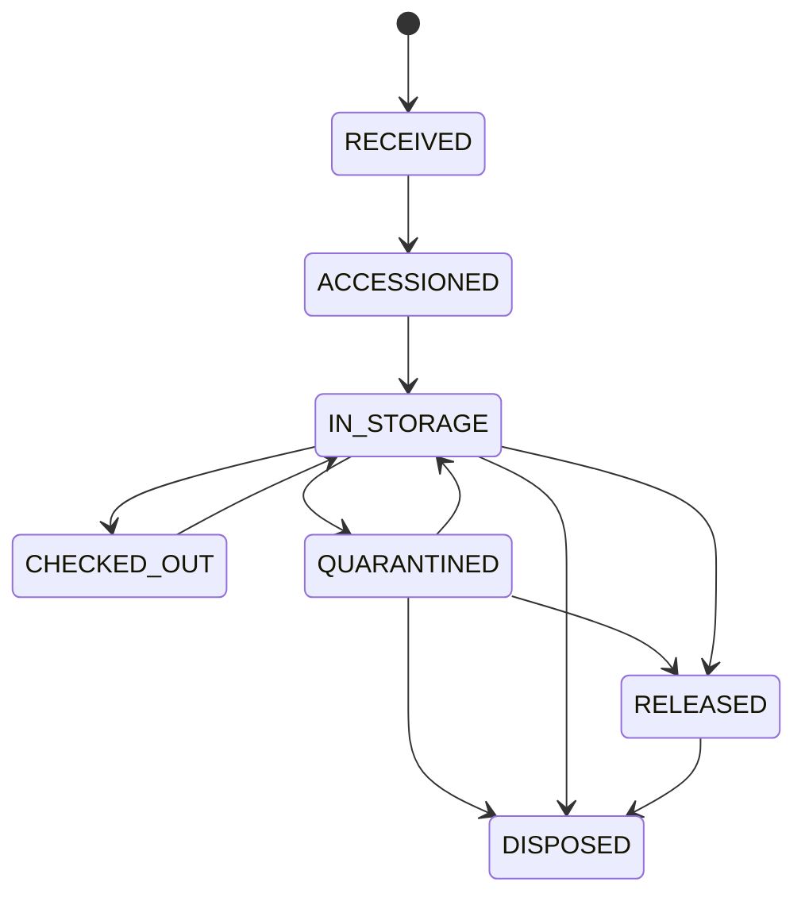

# TCS Biospecimen Platform

Biospecimen operations platform for intake, accessioning, inventory, custody, scientific lineage, and environmental exceptions. PostgreSQL is the system of record. Every business action is executed by the backend API and persisted transactionally.

## Architecture

Modular monolith: API → application services → domain rules → SQLAlchemy persistence.



```
backend/app/
  api/           HTTP adapters
  services/      business transactions
  models/        SQLAlchemy entities
  core/          security, errors, logging
  storage/       local disk adapter (S3/Azure-replaceable)
  seed/          deterministic seed data
```

Future CTMS, carrier, and cold-chain systems are expressed as unused adapter interfaces in `app/storage/adapters.py`. They are not implemented.

## Technology stack

| Layer | Choice |
| --- | --- |
| Frontend | React, Vite, JavaScript, React Router, TanStack Query, Zustand, Tailwind, Lucide, Recharts, React Flow |
| Backend | Python 3.12, FastAPI, Pydantic v2, SQLAlchemy 2, Alembic |
| Database | PostgreSQL 16 |
| Auth | JWT + Argon2 + RBAC |
| Tests | pytest, Playwright |
| Runtime | Docker Compose |

No Next.js. No runtime AI. No mocked APIs.

## URLs

After `docker compose up --build`:

- Frontend: http://localhost:5173
- Backend: http://localhost:8000
- Swagger: http://localhost:8000/docs
- OpenAPI: http://localhost:8000/openapi.json
- Health: http://localhost:8000/health
- Ready: http://localhost:8000/ready

## Seed credentials

| User | Role | Password |
| --- | --- | --- |
| operator@biospecimen.local | OPERATOR | LabOps@2026 |
| reviewer@biospecimen.local | REVIEWER | LabOps@2026 |
| admin@biospecimen.local | ADMIN | LabOps@2026 |

## Environment variables

See `.env.example`.

| Variable | Purpose |
| --- | --- |
| `DATABASE_URL` | SQLAlchemy PostgreSQL URL |
| `JWT_SECRET` | HMAC signing key |
| `JWT_EXPIRY_MINUTES` | Access token lifetime |
| `UPLOAD_DIR` | Manifest/label/evidence files |
| `APP_ENV` | Environment name |
| `CORS_ORIGINS` | Browser origins |

Do not commit production secrets. `.env` is gitignored except the local example values for Docker.

## Docker setup

```bash
cp .env.example .env
docker compose up --build
```

Equivalent: `make up`.

Postgres data and uploaded files live in Docker volumes. Restarting containers does not wipe business data. `make reseed` reloads seed data.

## Developer commands

```bash
make up            # docker compose up --build
make down
make migrate       # alembic upgrade head
make seed
make reseed        # wipe + reseed
make test          # pytest in backend container
make test-e2e      # Playwright against running stack
```

Migrations run automatically on backend start. Seed runs only when the database is empty.

## Domain concepts

**Sample** has an immutable internal ID `SMP-YYYY-NNNNNN`, optional external ID, and barcode alias. Status is a state machine, not a free-form field.

**Manifest** ingest: upload file → persist + SHA-256 → parse CSV/XLSX → map columns → validate rows → review → transactional commit to shipment + samples.

**Storage** is hierarchical: SITE / FREEZER / RACK / BOX / POSITION. Positions have capacity 1. Occupancy is enforced in the database (partial unique index) and in services.

**Lineage** creates a child sample (ALIQUOT or DERIVATIVE), consumes parent quantity, and records quantity transactions. Cycles of any depth are rejected.

**Exceptions** open from temperature excursions, quarantine the sample, and can only be resolved by REVIEWER or ADMIN.

## Sample lifecycle



Invalid transitions return `INVALID_STATUS_TRANSITION`. Quarantined samples cannot be moved (`SAMPLE_QUARANTINED`).

## Exception lifecycle

OPEN → (review) → RESOLVED

Dispositions:

- `RELEASE_TO_INVENTORY` → `IN_STORAGE`
- `RELEASE_WITH_RESTRICTION` → `RELEASED` + restriction flag
- `DISPOSE` → `DISPOSED`

## Lineage model

`LineageRelationship(parent, child, type, consumed, produced)` plus `QuantityTransaction` rows. Unit conversion is explicit among mL/uL and g/mg. Cross-dimension conversion is rejected.

## Testing

Backend tests cover validation, duplicates, IDs, accession, occupancy, movement, checkout/return, quarantine, quantity, cycles, RBAC, exception resolution, and audit.

```bash
make test
make test-e2e
```

Sample files: `sample-data/manifest_valid.csv` and `sample-data/manifest_invalid.csv` (includes an invalid quantity row, duplicate external ID, missing ID, non-numeric quantity, bad unit, and received-before-collection date).

## API errors

```json
{
  "code": "SAMPLE_QUARANTINED",
  "message": "Quarantined samples cannot be moved.",
  "details": {}
}
```

Requests carry `X-Request-ID`. Structured JSON logs include the correlation ID. Passwords and tokens are never logged.
